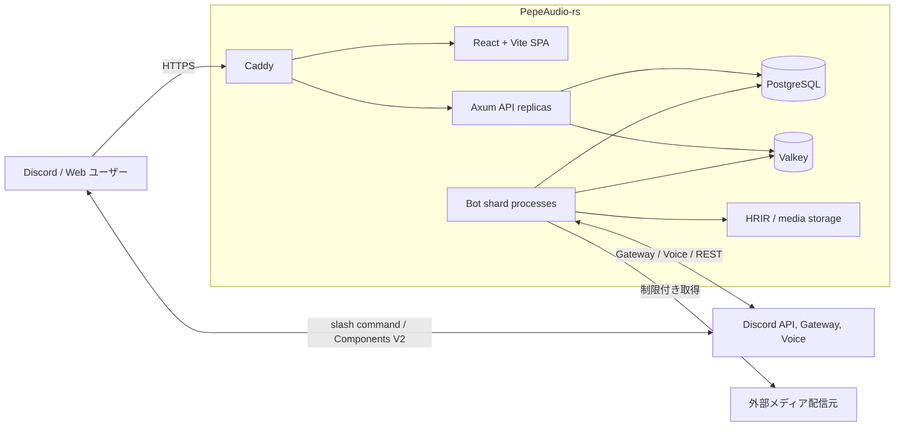
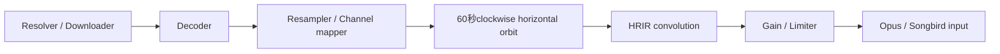
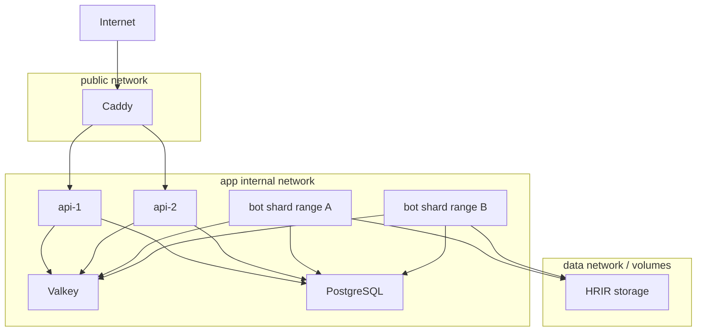

# PepeAudio-rs アーキテクチャ

- 文書状態: MVP実装済み・外部受入待ち
- 最終更新: 2026-08-13
- 対象: 初期実装からsharding対応まで
- 関連: [製品要求仕様](product-requirements.md)、[ADR 0001](decisions/0001-initial-architecture.md)、[ADR 0002](decisions/0002-horizontal-orbit.md)

## 確度

- **確定制約:** Rust、Serenity、Poise、Songbird、PostgreSQL、Valkey、Docker、Discord sharding、Components V2、Embed不使用、Windows 11、Ubuntu Server 26系列。
- **採用済み基盤:** Axum、React 19、TypeScript、Vite 8、Astryx／StyleX、SSE、Caddy、guild Player Actor、shard別Valkey Streams。
- **実装済み追加基盤:** Discord OAuth2 Authorization Code + PKCE、opaque Valkey session、FFmpeg→DSP→Songbird PCM pipeline、startup HRIR catalog、production Compose assembly。
- **未決定:** multi-host orchestrator、object storage製品、queue永続化範囲、site-specific extractor対応方針。

## 現在の実装境界

`pepeaudio-core`、`pepeaudio-components-v2`、`pepeaudio-hrir`、`pepeaudio-audio`、`pepeaudio-player`、`pepeaudio-config`、`pepeaudio-storage`、`pepeaudio-media`、`pepeaudio-pipeline`、`pepeaudio-runtime`、`pepeaudio-api`、`pepeaudio-auth`、`pepeaudio-server`、`pepeaudio-bot`と`web/`を実装した。Rust workspace、Web production build、FFmpeg smoke、PostgreSQL/Valkey/OAuth live test、development/production Compose model、production API/Caddy smokeをWindows 11とLinux containerで検証している。production BotもPostgreSQL、Valkey、HRIR catalog、media ingestion、Player Actor、Songbird pipeline、shard command workerへ配線済みである。一方、実Discord Gateway/Voice/DAVE/Components V2、Ubuntu Server 26.04実host、音響・負荷・長時間・failoverは外部受入が必要である。

`pepeaudio-hrir`はファイル読込と構造正規化、`pepeaudio-audio`は48 kHz化、共有frequency-domain delay lineによるpartitioned convolution、水平7方向補間、切替fadeを担う。60°幅のstereo pairを曲先頭の正面から60秒で時計回りに動かすsample-clocked orbitを採用した。Direct FIRは数値oracleとして残し、productionは単一orbitのrelease測定に基づき9,600 prepared frames（200 ms）を超えるIRをfail closedする。

## 設計原則

1. **Playerの正本はBot process内に置く。** Songbird Callを所有するguild Player Actorだけが再生状態を変更する。
2. **操作経路を統一する。** Discord command、Discord component、Web API、track event、timerを同じdomain commandへ変換する。
3. **永続設定と実時間状態を分ける。** PostgreSQLは設定・playlist・metadataの正本、Valkeyは配送・session・snapshot・cacheを担当する。
4. **失われて困る操作をPub/Subへ載せない。** commandはValkey Streams、通知はPub/Sub、復旧はversioned snapshotで行う。
5. **ブラウザへ毎秒状態を送らない。** 状態変化とanchorを送り、seek位置はクライアントが補間する。
6. **shard owner以外はVoiceを操作しない。** API replicaはSongbird handleを持たず、guildからshardを決めてcommandを配送する。
7. **Dockerを補助扱いにしない。** 開発、CI、本番の共通成果物をOCI imageとComposeで検証する。
8. **入力を信頼しない。** URL、添付、HRIR、OAuth callback、component custom IDはすべて検証する。
9. **音質と可用性をbuild結果から推測しない。** signal test、Discord実機、ブラウザE2E、障害試験を分ける。

## システムコンテキスト



## Runtime component

### Bot shard process

責務:

- Serenity Gateway shard lifecycle
- Poise command registration／dispatch
- Discord Components V2 interaction
- Songbird Voice connection
- guild Player Actor
- queue、idle timer、track lifecycle
- decoder／resampler／HRIR／360° DSP
- shard command Stream consumer
- Player snapshot更新とevent publish

Bot processだけがDiscord bot tokenを持つ。

### Axum API

責務:

- Discord OAuth2 login／callback／logout
- opaque session
- guild表示と認可
- REST command受付
- Rust wire DTOとTypeScript runtime validator（OpenAPI生成は将来作業）
- shard計算とValkey Stream投入
- Player snapshot取得
- Valkey event購読とSSE fan-out
- readiness／metrics

APIはSongbird CallやDiscord bot tokenを持たない。Bot参加guild一覧、shard readiness、Player snapshotはBotから共有storeへ反映する。

### React + Vite SPA

責務:

- guild navigation
- now playing／queue／settings UI
- REST mutation
- SSE subscribe／reconnect／resync
- seek bar補間
- optimistic UIとserver revisionへの収束
- responsive／accessibility

Astryx Neutral Themeと公開componentを視覚・interactionの正本にする。PepeAudio固有のlayoutだけをStyleX token moduleへ置き、生の色値やAstryx内部classへ依存しない。認証、SSE、command相関、wire validationは責務別hook／adapterへ分け、Player snapshotを別storeへ重複コピーしない。

### Caddy

責務:

- 80/443の唯一のpublic entry point
- TLS証明書とHTTP→HTTPS redirect
- Vite static assets
- SPA fallback
- `/api/*`、`/auth/*`、`/events/*`のreverse proxy
- hashed `/assets/*`だけを一年間immutable cacheし、SPA shellは`no-cache`
- cookie認証を含むAPI／auth／health responseは`private, no-store`
- production source mapを配布しない
- same-origin API、Discord guild icon CDNだけを許可するsecurity header
- SSEをbufferしないstreaming proxy

### PostgreSQL

責務:

- guild／userの最小metadata
- guild settings
- control policy
- HRIR metadata／license metadata
- playlist／playlist track
- audit event
- 必要なら復旧用queue checkpoint

### Valkey

責務:

- Web sessionとOAuth state
- 短期Discord guild cache
- Bot guild presence／readiness（owner fencing leaseは将来）
- shard別command Stream
- command idempotency（owner result channelは将来）
- versioned Player snapshot
- API向けevent Pub/Sub
- rate limit
- track metadata cache

### HRIR / media storage

- 組み込みHRIRはread-only image assetにできる。
- import済みHRIRはchecksum付き内部形式として保存する。
- 単一hostではnamed volumeを使用できる。
- multi-hostではS3互換storageへ切り替えられるinterfaceにする。
- PostgreSQLにはobject keyとmetadataだけを保存する。
- 一時mediaは期限付き領域へ保存し、Web rootから直接公開しない。process-local lease、hard admission quota、janitorの境界を守るため、共有volume内でも`<instance_id>/staging`と`<instance_id>/objects`へ分離する。起動時に両directoryをlink追跡なしで全件会計し、未知entry／検査失敗／entry上限超過はfail closedとする。各downloadはDNS/HTTP前に容量を予約し、commit後は実size、削除後は0へ同じledgerを更新する。

## 暫定リポジトリ境界

実在するcrateとruntime境界を同じtreeに示す。`[自動検証済み]`はunit／integration testまたはLinux container smokeまで完了した限定範囲を意味する。実Discord、実HRIR聴感、Ubuntu 26.04実hostでの受入はこの表示に含めない。

```text
PepeAudio-rs/
├─ Cargo.toml                  # workspace
├─ crates/
│  ├─ pepeaudio-core/          # [自動検証済み] Player command／state、ID、shard計算
│  ├─ pepeaudio-components-v2/ # [自動検証済み] Components V2 wire model／adapter
│  ├─ pepeaudio-hrir/          # [自動検証済み] 7/14ch HeSuVi WAV読込・構造正規化
│  ├─ pepeaudio-audio/         # [自動検証済み] resample、partitioned convolution、水平orbit
│  ├─ pepeaudio-player/        # [自動検証済み] bounded guild Actor、queue、5分idle timer
│  ├─ pepeaudio-config/        # [自動検証済み] typed env／Docker secret設定
│  ├─ pepeaudio-storage/       # [自動検証済み] SQLx、Valkey snapshot／Streams／dedupe
│  ├─ pepeaudio-media/         # [自動検証済み] HTTPS／attachment取得、quota、lease、janitor
│  ├─ pepeaudio-pipeline/      # [自動検証済み] FFmpeg→DSP→Songbird playback adapter
│  ├─ pepeaudio-presets/       # [自動検証済み] HRIR catalog／prepared asset cache
│  ├─ pepeaudio-runtime/       # [自動検証済み] shard worker、snapshot／settings retry、presence
│  ├─ pepeaudio-api/           # [自動検証済み] Axum REST／SSE transport
│  ├─ pepeaudio-auth/          # [自動検証済み] Discord OAuth、opaque Valkey session
│  ├─ pepeaudio-server/        # [自動検証済み] production API assembly
│  └─ pepeaudio-bot/           # [自動検証済み] Serenity／Poise／Songbird production assembly
├─ web/                        # [自動検証済み] React + TypeScript + Vite dashboard
├─ migrations/                 # [自動検証済み] SQLx migrationとruntime権限
├─ deploy/                     # [自動検証済み] Caddy、Valkey、PostgreSQL、OCI build
└─ docs/
```

循環依存を避けるため、`pepeaudio-core`はSerenity、Songbird、Axum、SQLxの型を公開interfaceへ漏らさない。Discord interactionとHTTP requestはadapterでdomain commandへ変換する。

## 状態所有権

| 状態 | 正本 | 複製／cache | 備考 |
|---|---|---|---|
| Voice connection | Bot shard process / Songbird | shard readiness | processを跨いで直接共有しない |
| 現在曲・queue・position | guild Player Actor | Valkey Player snapshot | snapshotは表示・復旧支援用 |
| idle timer | guild Player Actor | deadlineをsnapshotへ表示可能 | timer発火時にrevision確認 |
| volume／repeat／shuffle | Player Actor | snapshot、volumeのみPostgreSQL default | repeat／shuffleはlive sessionだけ |
| HRIR／360° runtime state | Player Actor / audio pipeline | snapshot、PostgreSQL default | 成功した切り替えをlatest-wins workerで非同期永続化 |
| guild既定設定 | PostgreSQL | Valkey invalidation/cache | PostgreSQLが正本 |
| playlist | PostgreSQL | Query cache | transactionで更新 |
| Web session | Valkey | Cookieはopaque IDだけ | OAuth tokenをブラウザへ返さない |
| command delivery | Valkey Stream | idempotency + command result | terminal結果保存後だけACKし、Webはcommand ID単位で結果を照会 |
| Web event | snapshot + revision | Pub/Sub + API local broadcast | Pub/Sub単独を正本にしない |

## Guild Player Actor

guildごとに一つのActorを作り、bounded `mpsc`等でcommandを直列化する。Actorは次を所有する。

```text
guild_id
revision
voice_channel_id
songbird_call_handle
player_state
current_track
queue
history
repeat_mode
shuffle_state
volume
hrir_preset
spatial_state
position_anchor
idle_deadline
```

外部taskは内部fieldをlockして直接書き換えず、commandを送る。

暫定command:

```text
Join
Enqueue
Play
Pause
Resume
Seek
Skip
Stop
SetVolume
SetRepeat
Shuffle
SetHrir
SetSpatialEnabled
TrackReady
TrackEnded
TrackFailed
IdleDeadlineReached
VoiceDisconnected
Shutdown
```

各command処理後、状態が変化した場合だけrevisionを増やす。長いmedia resolve、download、HRIR preprocessをActor loop上で同期実行せず、jobをspawnして結果を`TrackReady`等で戻す。古いjob結果には開始時revision／track tokenを付け、現在状態と一致しなければ破棄する。

### 5分idle timer

暫定実装:

1. 現在曲なし、queue空、Voice接続中になったとき`IdleConnected`へ遷移。
2. `idle_generation`と単調時計による300秒deadlineを記録。
3. timer taskは`IdleDeadlineReached { generation }`をActorへ送るだけにする。
4. Actorがgeneration、状態、queueを再確認する。
5. 一致した場合だけSongbirdから退出し、Disconnected snapshotを公開する。
6. idle Actor taskを終了し、registryは次の操作時にstale handleを置換する。
6. enqueue、play、手動disconnect、shutdownでgenerationを更新して古いtimerを無効化する。

Pausedは現在曲を保持するためMVPではidleに含めない。guildから恒久的に削除された場合はregistry entryを除去し、Actorをgraceful shutdownする。

## Discord 操作フロー

```mermaid
sequenceDiagram
    participant User as Discord User
    participant Discord
    participant Bot as Bot shard
    participant Policy as Authorization
    participant Actor as Guild Player Actor
    participant Voice as Songbird / Audio

    User->>Discord: /play, /now, component
    Discord->>Bot: Interaction
    Bot->>Policy: guild / member / VC / permission
    Policy-->>Bot: allow or reject
    Bot->>Actor: typed PlayerCommand
    Actor->>Voice: state transition / playback operation
    Voice-->>Actor: track event
    Actor-->>Bot: PlayerSnapshot / result
    Bot-->>Discord: Components V2 response/update
```

Discord応答はComponents V2のみを使用し、Embedを構築するhelper自体をDiscord UI層に持ち込まない方針とする。Components V2の使用時は公式のmessage flagとcomponent構造制限に従う。実装済みwire adapterはContainerの`accent_color`をserializeせず、buttonを標準secondary styleに固定している。runtime adapterでもこの既定を維持する。

## Web commandフロー

```mermaid
sequenceDiagram
    participant Browser
    participant API as Axum API
    participant Valkey
    participant Bot as Shard owner
    participant Actor as Guild Player Actor

    Browser->>API: POST command + CSRF + Idempotency-Key
    API->>API: session / guild permission / input検証
    API->>API: shard_id = (guild_id >> 22) % total
    API->>Valkey: XADD cmd:shard:{id}
    Bot->>Valkey: XREADGROUP
    Bot->>Actor: typed PlayerCommand
    Actor-->>Bot: result + revision
    Bot->>Valkey: SET versioned snapshot
    Bot->>Valkey: PUBLISH guild event
    Bot->>Valkey: XACK command
    API-->>Browser: 202 Accepted + command ID
    Valkey-->>API: guild event
    API-->>Browser: SSE revision event
```

現在のAPIはStreamへの永続投入を確認して`202 Accepted`とcommand IDを返す。Webは操作を直列化し、revisionが進むまで最大5秒間snapshotを再取得する。担当Botによる反映を確認できなければ、成功表示せず「受理済み・反映未確認」と表示する。owner-sideの拒否理由を直接返すcommand result channelは今後のhardening項目である。

## Discord sharding

Discord公式式:

```text
shard_id = (guild_id >> 22) % num_shards
```

Discordは1 shardあたり最大2,500 guildとし、`Get Gateway Bot`で推奨shard数を返す。実装は固定値を推測せずDiscordの推奨値とsession start limitを確認する。

MVPのBot process設定:

```text
PEPEAUDIO_INSTANCE_ID
PEPEAUDIO_SHARD_TOTAL
PEPEAUDIO_SHARD_START
PEPEAUDIO_SHARD_END_EXCLUSIVE  # 1 processでは省略可。省略時はSHARD_TOTAL
```

### Shard ownership

MVPはorchestrator／Compose設定でshard rangeを排他的に所有する。同じshard rangeを持つBotを同時起動せず、upgradeはstop-before-startとする。異なるrangeは並行起動できる。

将来のrolling overlapには、Valkeyへ短いTTLのowner recordとmonotonic epochを置き、command/snapshotをfenceする。

```text
shard:{shard_id}:lease = { instance_id, deployment_epoch }
```

- processはowner tokenを使って定期renewする。
- lease消失時は新規Web commandを受けず、Gateway owner状態を確認する。
- leaseだけで分散一貫性を証明しない。orchestratorのshard range設定とDiscord sessionを主とし、leaseはfencing／診断に使う。
- stale processからのsnapshot更新にはdeployment epochを付け、新ownerの状態を上書きさせない。これはMVP未実装であり、同一rangeのrolling overlapを許可しない理由である。

### Shard別Valkey Streams

key:

```text
cmd:shard:{shard_id}
```

一つのglobal Streamを複数Botが同じconsumer groupで読むと、対象guildを所有しないconsumerへcommandが渡り得る。shardごとにStreamを分け、担当ownerだけが読む。

現在のcommand envelope:

```json
{
  "command_id": "uuid",
  "idempotency_key": "uuid",
  "guild_id": "snowflake-as-string",
  "actor_user_id": "snowflake-as-string",
  "expected_revision": 42,
  "deadline": 1786543210000,
  "command": { "type": "skip" }
}
```

Webのqueue並べ替えは、変動しやすい配列indexではなく安定UUIDを使う。`before_track_id`が`null`なら末尾へ移動する。通常commandと同じ`expected_revision`を要求するため、古い画面からの並べ替えは現在queueを無言で上書きしない。

```json
{
  "type": "move_queued",
  "track_id": "8a947ed0-78ce-498b-8a7d-abf46d81fe5e",
  "before_track_id": "7e81f965-f9c4-476a-a643-59178cbbbd23"
}
```

要件:

- `command_id`のUUID versionをwire contractにせず、初期実装はcoreと同じUUID v4を生成する。配送順序はUUIDではなくValkey Stream IDで扱う。
- `XREADGROUP` + 明示的`XACK`
- 処理済みentryは一つのLua操作で`XACK`+`XDEL`する
- enqueueもLuaで`XLEN`を検査し、100,000件到達時は古い未処理entryをtrimせずfail closedする
- malformed entryは一件ずつdecodeし、該当IDだけをACK/削除して同じbatchの正常commandを継続する
- crash後はpending historyを読み、必要なら`XAUTOCLAIM`
- `idempotency_key`でdedupe
- deadlineを過ぎた操作は適用せずpermanent rejectionとして完了させる
- poison messageはpayloadをlogせずACK/削除する。dead-letterと診断counterは将来追加する
- stream backlogをmetrics化

Valkey Streamsも一般的な意味でexactly-onceではない。Actor適用とdedupe recordの順序を定義し、二重skip等を防ぐ。

## Player snapshot とevent

snapshot例:

```json
{
  "guild_id": "123456789012345678",
  "voice_channel_id": "223456789012345678",
  "revision": 91,
  "state": "playing",
  "track": {
    "track_id": "uuid",
    "title": "Example",
    "requester_user_id": "323456789012345678",
    "duration_ms": 240000,
    "position_ms": 45120,
    "seekable": true
  },
  "queued_tracks": 4,
  "upcoming_tracks": [],
  "has_previous_track": true,
  "volume": 75,
  "repeat_mode": "off",
  "shuffle_enabled": false,
  "hrir_preset": "preset-id",
  "spatial_audio_enabled": true,
  "observed_at": 1786543200000
}
```

実装key（環境prefixを前置）:

```text
player:{guild_id}:snapshot
player:{guild_id}:snapshot:revision
```

Botはsnapshot更新を完了してから`evt:guild:{guild_id}`へrevision eventをpublishする。bodyには24時間TTL、単調revision watermarkにはTTLを付けない。Bot processがそのguildを初めて所有したときbodyだけを正確なkeyで無効化し、watermarkの次からActorを開始する。Pub/Sub eventを失っても、API／Browserはsnapshotで回復できる。

## REST + SSE

暫定API:

```text
GET    /api/v1/me
GET    /api/v1/guilds
GET    /api/v1/guilds/{guild_id}/player
GET    /api/v1/guilds/{guild_id}/events
GET    /api/v1/guilds/{guild_id}/queue
GET    /api/v1/guilds/{guild_id}/settings
GET    /api/v1/guilds/{guild_id}/hrir-presets
POST   /api/v1/guilds/{guild_id}/player/commands
GET    /api/v1/guilds/{guild_id}/player/commands/{command_id}
PUT    /api/v1/guilds/{guild_id}/settings
POST   /api/v1/guilds/{guild_id}/queue/items
DELETE /api/v1/guilds/{guild_id}/queue/items/{item_id}
```

### SSE接続

`GET /events`は認可後、次を行う。

1. 現在snapshotを`event: snapshot`として送る。
2. 対象guildのValkey channelをAPI replicaが購読する。
3. local bounded broadcastから各browserへfan-outする。
4. 15秒程度のSSE comment keepaliveを送る。
5. eventに`id`とrevisionを設定する。
6. local receiverのlagやrevision gapでは`event: resync`を送る。
7. clientは完全snapshotを再取得する。

SSEは一方向であり、変更操作はRESTに限定する。これにより、CSRF、idempotency、HTTP status、retryを通常のrequest semanticsで扱える。

### シーク位置

Browserはsnapshotの`position_ms`と`observed_at`からPlaying中の位置を補間する。production hostとclientの時刻差が表示誤差になるため、hostのNTPを必須とし、将来はresponse時刻からoffsetを推定する。tabがbackgroundから復帰した場合はsnapshotを再取得する。

## PostgreSQL model

初期schema候補:

| Table | 主なfield | 正本 |
|---|---|---|
| `app_users` | Discord user ID、表示名cache、avatar、last login | 最小プロフィール |
| `guilds` | Discord guild ID、name/icon cache、bot present、last seen | guild inventory |
| `guild_settings` | volume、idle秒、control policy、DJ role、default HRIR、360°有効状態、revision | 設定 |
| `hrir_presets` | scope、metadata、object key、checksum、license | preset目録 |
| `playlists` | owner、guild、name、visibility | 保存playlist |
| `playlist_tracks` | position、source descriptor、表示metadata | playlist内容 |
| `audit_events` | actor、guild、action、result、time | 監査 |

Discord snowflakeはHTTP／JSONで文字列として扱う。PostgreSQLにunsigned 64-bit型がないため、初期案では`TEXT COLLATE "C"` + 数字形式CHECKとし、API境界との不整合を避ける。shard計算時だけRustの`u64`へ厳密parseする。

playlist等の内部IDはUUIDv7を使用する案とする。PostgreSQL 18は`uuidv7()`を提供するが、application生成とDB生成のどちらを正本にするかは統一する。

### Migration

- SQLx migration fileをversion管理する。
- Composeのone-shot `migrate` serviceが先に完了する。
- runtime API／Bot roleにschema owner権限を与えない。
- production起動時に各replicaが競合してDDLを実行しない。
- migration前にbackup／rollback可否を確認する。

## Valkey keyspace

| Pattern | 用途 | Retention案 |
|---|---|---|
| `sess:{hash}` | Web session | production既定・hard maximumともabsolute/idle 30分 |
| `oauth-state:{nonce}` | OAuth CSRF state | 既定5分、一回消費、環境設定で変更 |
| `oauth-guilds:{user}` | Discord guild cache | 1～5分 |
| `bot-presence:{guild}` | owning Botのguild membership | 短期TTL／owner token付きclear |
| `cmd:shard:{id}` | command Stream | `MAXLEN ~ 100000`、処理後XDEL |
| `cmd-result:{id}` | Pending／Applied／Denied／Rejected command result | command受付時にPending、terminal保存後TTL |
| `processed:{guild}:{id}` | idempotency | command最大再送期間以上 |
| `player:{guild}:snapshot` | current display state | ownerが更新、切断後TTL |
| `evt:guild:{guild}` | Pub/Sub | 非永続 |
| `ratelimit:{scope}:{subject}` | token bucket | windowに応じる |
| `track-meta:{hash}` | resolver metadata | source別TTL |

command Streamを同じValkeyで扱う初期構成では、`maxmemory-policy noeviction`、AOF、memory監視、明示TTL／trimを使う。単なるcache設定でStreamをevictさせない。

Rust clientは`redis-rs`のTokio async connectionを候補とする。通常commandはclone可能なmultiplexed connection／ConnectionManager、Pub/Subとblocking Stream readは専用connectionへ分ける。

## OAuth session と認可

### Login

1. APIが暗号学的nonceを生成。
2. `oauth-state`へ短期保存。
3. Discord OAuth2 Authorization Codeへredirect。
4. callbackでstateを検証し、一度だけ消費。
5. codeをserver側でtoken exchange。
6. `identify guilds`でuserとpartial guildを取得。
7. opaque session IDをCookieへ設定。
8. userとguild projectionをsessionへ保存し、access／refresh tokenはcallback処理後に破棄する。

Cookie候補:

```text
Name: __Host-pepeaudio_session
Secure: true
HttpOnly: true
SameSite: Lax
Path: /
Domain: unset
```

変更requestにはsession-bound CSRF token、Origin／Fetch Metadata検証を加える。OAuth tokenはブラウザのlocalStorage、sessionStorage、JavaScript-readable Cookieへ置かない。

### Guild authorization

APIは次を照合する。

- OAuth guild listのowner／permissions
- Botがそのguildに参加中か
- guild control policy
- 必要ならBot gateway cache上のcurrent Voice Channel

権限cacheは短期にし、guild設定変更等の高権限操作前には再検証する。Discord rate limit値をhard-codeせずresponse headerへ従う。

### Session実装

production APIは独自のopaque session tokenを生成し、ブラウザには`__Host-pepeaudio_session` Cookieだけを渡す。Valkeyにはtokenそのものではなくhashをkeyとして保存し、absolute/idle expiry、OAuth stateの一回限り消費、logout時の破棄をLuaで原子的に扱う。Discord access／refresh tokenは保持せず、現在のsessionを指すuser pointerにより同一userの新規login時に古いsessionを認可対象外にする。guild membershipはlogin時projectionなのでproductionのabsolute期限は既定・hard maximumとも30分とし、SSEも定期再認可とbounded lifetimeを持つ。したがってguild退出・kickの反映は即時ではなく最大30分遅れる。完全な即時反映には、将来Bot所有のmembership queryまたは安全なOAuth token refresh境界が必要である。

## Audio pipeline境界



HeSuVi互換presetから得られる基本入力は、水平面上の固定7仮想スピーカー方向それぞれに対する左右耳用impulse responseである。preset単独には高さ方向も、任意azimuth／elevationを連続queryできるHRTF surfaceもない。MVPは60°幅のstereo pairを60秒で時計回りに動かし、隣接2方向をequal-power補間する。これはPepeAudio-rsが追加するguild共通の水平近似であり、presetが真の連続3Dを提供するとは扱わない。正本は[ADR 0002](decisions/0002-horizontal-orbit.md)とする。

暫定原則:

- network I/O、decode、HRIR preprocessをDiscord Gateway taskから分離する。
- audio realtime pathでfilesystem parse、DB query、Valkey queryを行わない。
- filter切り替え用IRはcache済みの`PreparedHrir`として渡し、filesystem/networkをPCM workerへ持ち込まない。
- preset切り替え時はcrossfade等でclickを抑える。
- sample rate／channel layoutを明示し、暗黙変換を避ける。
- NaN／Inf／denormal／peakをtestする。
- processing durationとunderrunを計測する。
- bypass、HRIR有効、360°有効を別々に比較する。
- sourceごとに一つのfrequency-domain delay lineを共有し、orbit時は隣接2方向のIR spectrumをmixして2耳×2 sourceだけを逆変換する。完全dryでは逆変換を省略して入力spectrum履歴だけを更新する。
- measured partitioned backendでは9,600-frame production上限を超えるpresetを起動時に拒否する。

Discordへは最終的に一つのステレオstreamを送るため、同一guildのリスナー全員が同じHRIR／360°状態を共有する。

## Security architecture

### Trust boundary

信頼しない入力:

- Discord user input
- URLとredirect
- DNS応答
- Discord attachment
- Web upload
- HRIR fileとmetadata
- OAuth callback parameter
- Cookie
- component custom ID
- media metadata／artwork URL
- PostgreSQL／Valkeyに残った古いschema data

### SSRF

`/play url`では少なくとも次を行う。

- production `/play url`は`https`だけを許可し、redirectもHTTPSを維持する。HTTPSからHTTPへのdowngradeを拒否
- URL parserを一つに統一
- user-info、異常port、巨大URLを拒否
- 全A／AAAAを解決し、loopback、private、link-local、multicast、unspecified、metadata addressを拒否
- redirectごとに再検証
- redirect回数、response size、download timeを制限
- IPv4-mapped IPv6等の表現差を正規化
- network policyでもprivate／metadata宛を遮断
- downloaderをshell経由で起動しない

application事前検査だけでは、別processのdownloaderが独自にDNS解決することで差が生じ得る。可能なら制限付きegress proxyまたは隔離network namespaceを使用する。

### Upload

- reverse proxyとAPIの両方でbody limit
- extensionではなくmagic／decoder parseを検査
- duration、sample rate、channel、impulse length上限
- random object key
- original filenameをpathへ使わない
- Web root外
- quota、TTL、cleanup
- parseはresource limit付きworker

### Container

- non-root
- `read_only: true`を可能なserviceへ適用
- `/tmp`はtmpfs／size limit
- `no-new-privileges`
- Docker socketをmountしない
- Bot／API／DB／Valkeyのcredential分離
- PostgreSQL／Valkey portをpublishしない
- Caddyだけをpublic networkへ接続

## Docker / deployment

### Compose topology



services候補:

```text
caddy
api
bot
migrate
postgres
valkey
otel-collector    optional profile
prometheus        optional profile
grafana           optional profile
tempo/loki        optional profile
```

### Images

- Rust builder stageでBot／APIをcompile。
- API runtimeはCA証明書を含むminimal Debian系image。
- Bot runtimeはFFmpeg／Opus等、実際に必要なruntime依存だけを含む。
- WebはNode 24 LTS builderでVite `dist`を作り、Caddy runtimeへcopy。productionにNode serverを残さない。
- image tagはpatch version、productionは可能ならdigestも固定。

### Startup

1. PostgreSQL／Valkey healthcheck
2. migration service成功
3. API／Bot起動
4. Bot shard ready
5. Caddyがready APIへtraffic

Composeの`depends_on`だけではreadyを待たないため、`service_healthy`と`service_completed_successfully`を使う。

### PostgreSQL 18 volume

PostgreSQL official imageは18以降、volumeの扱いが変わっている。初期Composeでは公式説明に合わせて`/var/lib/postgresql`へnamed volumeをmountし、upgrade手順を文書化する。

### Production host

- Ubuntu Server 26.04 LTS Resolute
- Docker公式apt repository
- Docker Engine + Buildx + Compose plugin
- 80/443のみpublic
- firewallはDockerのufw迂回と`DOCKER-USER` chainを考慮
- off-host PostgreSQL backup
- Caddy data/config volume
- log rotationとdisk alert
- NTP／時刻同期

### Windows 11

- Docker Desktop WSL 2 backend
- Linux containers
- native Rust／Node unit testも許可
- production parityはCompose testを基準
- bind mount性能が問題ならWSL filesystem上のcloneで検証
- line endingやfilesystem case差をCI Linuxで検出

Composeは単一hostの正式配布経路とする。multi-hostの最終orchestratorは**未決定**であり、Docker full supportとKubernetes必須を同義にしない。

## Failure mode

| 障害 | 期待する動作 | 検証 |
|---|---|---|
| API replica停止 | 他replicaへ再接続、SSE snapshot再同期 | connection kill test |
| Valkey Pub/Sub切断 | eventを失ってもsnapshotへresync | network fault |
| Stream consumer停止 | pending commandを新ownerがclaim | crash before XACK |
| Valkey全停止 | Web操作はdegraded／503、既存Bot再生を可能な限り継続 | service stop |
| PostgreSQL停止／lock競合 | 既存Actorのvolume／HRIR／360°変更はruntimeへ反映し、latest-wins workerが永続化を再試行する。pool取得5秒、statement 10秒、lock 5秒で失敗を局所化し、新規Player生成やDB依存操作は失敗し得る。shutdown時の最終flush失敗は正常終了にしない | service stop / table lock |
| Bot process停止 | Voice切断を許容、queue復旧方針に従う | SIGKILL |
| stale timer発火 | revision／generation不一致で無視 | deterministic clock test |
| track resolve hang | timeout後に次曲またはIdle | fake resolver |
| HRIR切り替え失敗 | 現在filterを維持、error event | invalid preset |
| slow SSE client | bounded buffer、resync、他clientへ波及させない | backpressure test |
| duplicate command | idempotencyで一回だけ適用 | replay test |
| reshard | Voice中断を許容し、MVPではstop-before-startとrange非重複を要求 | staging drill |

## Observability

### Logging

`tracing`によるJSON log。field候補:

```text
service
instance_id
deployment_epoch
shard_id
guild_id
command_id
request_id
trace_id
player_revision
event_type
error_code
```

OAuth token、session ID、Cookie、Discord token、secret、完全なuser URL query、upload内容はlogへ出さない。guild／user IDのlog保持期間はprivacy方針で決める。

### Metrics

```text
pepeaudio_shard_ready
pepeaudio_voice_calls
pepeaudio_player_commands_total
pepeaudio_player_command_duration_seconds
pepeaudio_stream_pending
pepeaudio_stream_oldest_pending_seconds
pepeaudio_audio_processing_duration_seconds
pepeaudio_audio_underruns_total
pepeaudio_track_failures_total
pepeaudio_sse_connections
pepeaudio_sse_resync_total
pepeaudio_idle_disconnects_total
```

guild ID、user ID、track IDをmetric labelに使わない。

### Health

- `/health/live`: process event loopが応答できる。
- `/health/ready`: 必要依存とconsumerが新規trafficを扱える。
- `/health/startup`: migration／初期化／shard identifyの進行。

依存障害をliveness failureに直結させ、再起動loopを起こさない。

### Trace

HTTP request → Valkey command → Bot consume → Actor apply → snapshot publishを`traceparent`相当で関連付ける。OpenTelemetry OTLP exportはoptionalで、collector停止がaudio pathをblockしないようbatch／drop policyを設ける。

## Testing strategy

### Unit

- Player state transition
- idle timer generation
- queue／repeat／shuffle
- permission policy
- shard formula
- command encode／decode／schema version
- snapshot revision
- URL／IP validation
- HRIR parser／mapping／convolution fixture

### Property / fuzz

- HRIR／audio container parser
- component custom ID parser
- URL normalization
- command event deserialization
- queue state transition

### Integration

- PostgreSQL migration／transaction
- Valkey Stream ack／pending／claim／dedupe
- OAuth callback state
- SSE reconnect／lag／resync
- Caddy routing
- Docker health order

### Discord staging

- slash command登録
- Components V2 payload
- Embed不使用
- Voice join／move拒否／disconnect
- URL／attachment再生
- interaction timeout／deferred response
- shard range

### Audio

- impulse response
- sine／sweep／silence
- left／right／virtual direction
- sample rate変換
- peak／RMS／NaN／Inf
- filter switch click
- sustained CPU／underrun
- Discordからrecordしたend-to-end出力

### Web E2E

- OAuth mock／staging
- guild選択
- play/pause/seek/skip/stop
- volume／HRIR／360°
-複数tab
- SSE切断
- stale revision
- responsive／keyboard

## Version baseline

2026-08-12の調査開始点。実装時に互換性を再確認し、lockfileへ固定する。

| 領域 | Baseline |
|---|---|
| Rust | 1.97.0、Edition 2024（`rust-toolchain.toml`） |
| Axum | 0.8.9 |
| Tokio | 1.53.1 |
| SQLx | 0.9.0 |
| redis-rs | 1.5.0 |
| reqwest | 0.12.28（Discord OAuth固定endpoint client） |
| Serenity / Poise / Songbird | 0.12.5 / 0.6.2 / 0.6.0 |
| OpenAPI / OpenTelemetry | 計画、現lockfileには未導入 |
| Node.js | 24 LTS |
| React | 19.2.x |
| Vite | 8.x |
| TypeScript | 7.0.x |
| Astryx / StyleX | 0.3.0 / 0.19.0（exact pin） |
| PostgreSQL | 18.4 |
| Valkey | 9.1.1 |

versionは設計判断ではなく更新可能なbaselineである。major更新はCI、migration、Discord staging、audio regressionを通してから採用する。

## 一次資料

### Discord

- [Gateway、sharding式、2,500 guild制限](https://docs.discord.com/developers/events/gateway)
- [Application Commands](https://docs.discord.com/developers/interactions/application-commands)
- [Message Components reference](https://docs.discord.com/developers/components/reference)
- [OAuth2 Authorization Codeとstate](https://docs.discord.com/developers/topics/oauth2)
- [Current User Guilds](https://docs.discord.com/developers/resources/user)
- [Rate Limits](https://docs.discord.com/developers/topics/rate-limits)
- [Voice Connections](https://docs.discord.com/developers/topics/voice-connections)

### Rust / Web

- [Songbird](https://docs.rs/songbird/latest/songbird/)
- [HeSuVi: impulse responseの記録方法と7 channel / 14 IR構造](https://sourceforge.net/p/hesuvi/wiki/How-To%20Record%20Impulse%20Responses%20Digitally/)
- [Axum SSE](https://docs.rs/axum/latest/axum/response/sse/)
- [Axum WebSocket](https://docs.rs/axum/latest/axum/extract/ws/)
- [Tokio broadcastとlag](https://docs.rs/tokio/latest/tokio/sync/broadcast/)
- [SQLx 0.9](https://docs.rs/crate/sqlx/latest)
- [SQLx embedded migrations](https://docs.rs/sqlx/latest/sqlx/macro.migrate.html)
- [redis-rs async connection](https://docs.rs/redis/latest/redis/)
- [oauth2 crate SSRF warning](https://docs.rs/oauth2/latest/oauth2/)
- [Vite production build](https://vite.dev/guide/build.html)
- [Vite static deployment](https://vite.dev/guide/static-deploy.html)
- [Astryx Getting Started](https://astryx.atmeta.com/docs/getting-started)
- [StyleX Vite integration](https://stylexjs.com/docs/learn/installation/vite/vite-react)
- [HTML Server-Sent Events](https://html.spec.whatwg.org/multipage/server-sent-events.html)

### Data / deployment

- [Valkey Streams](https://valkey.io/topics/streams-intro/)
- [Valkey XREADGROUP](https://valkey.io/commands/xreadgroup/)
- [Valkey XAUTOCLAIM](https://valkey.io/commands/xautoclaim/)
- [Valkey Pub/Sub at-most-once semantics](https://valkey.io/topics/pubsub/)
- [PostgreSQL version policy](https://www.postgresql.org/support/versioning/)
- [PostgreSQL official Docker image](https://hub.docker.com/_/postgres/)
- [Docker Engine on Ubuntu 26.04](https://docs.docker.com/engine/install/ubuntu/)
- [Docker multi-stage builds](https://docs.docker.com/build/building/multi-stage/)
- [Compose startup orderとhealthcheck](https://docs.docker.com/compose/how-tos/startup-order/)
- [Compose secrets](https://docs.docker.com/compose/how-tos/use-secrets/)
- [Docker Desktop WSL 2](https://docs.docker.com/desktop/features/wsl/)
- [Caddy reverse proxy](https://caddyserver.com/docs/caddyfile/directives/reverse_proxy)
- [Caddy automatic HTTPS](https://caddyserver.com/docs/quick-starts/https)

### Security / observability

- [OWASP SSRF Prevention](https://cheatsheetseries.owasp.org/cheatsheets/Server_Side_Request_Forgery_Prevention_Cheat_Sheet.html)
- [OWASP File Upload](https://cheatsheetseries.owasp.org/cheatsheets/File_Upload_Cheat_Sheet.html)
- [OWASP CSRF Prevention](https://cheatsheetseries.owasp.org/cheatsheets/Cross-Site_Request_Forgery_Prevention_Cheat_Sheet.html)
- [OpenTelemetry Rust OTLP](https://docs.rs/opentelemetry-otlp/latest/opentelemetry_otlp/)
- [Prometheus metric／label guidance](https://prometheus.io/docs/practices/naming/)
